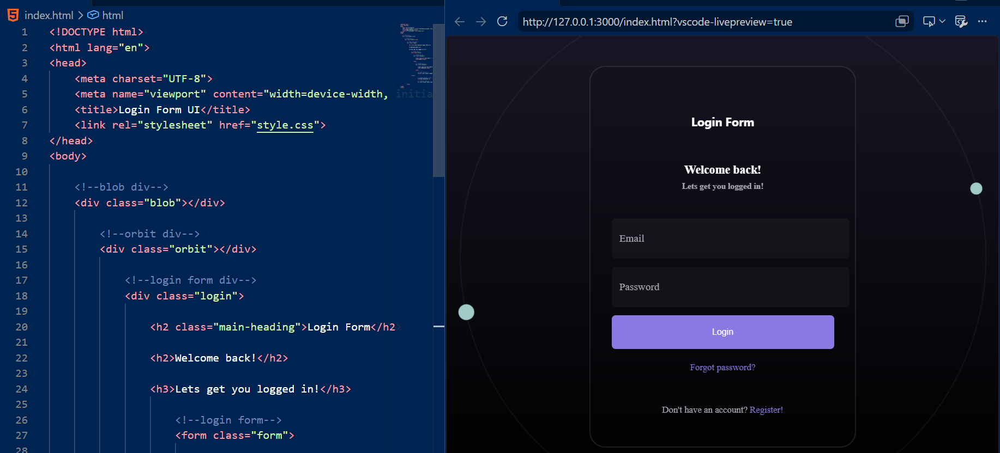
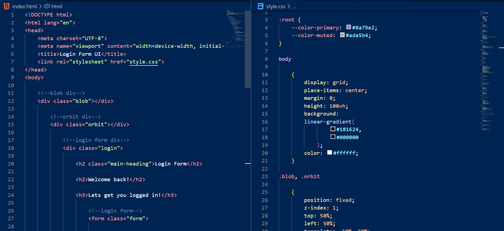
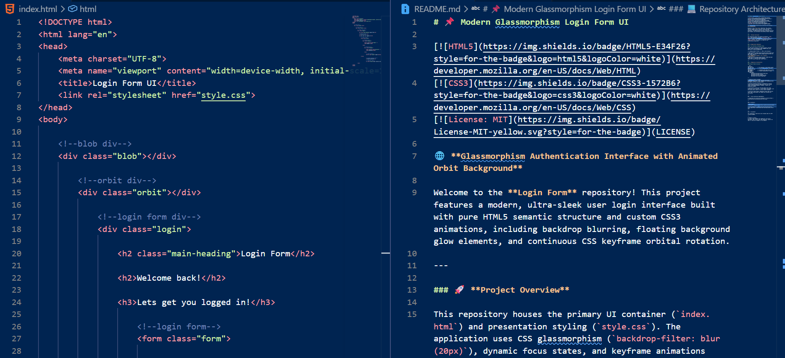
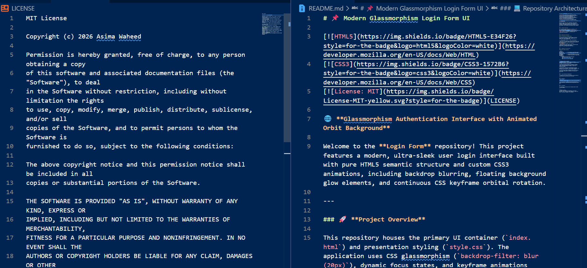

# 📌 Modern Glassmorphism Login Form UI

[](https://developer.mozilla.org/en-US/docs/Web/HTML)
[](https://developer.mozilla.org/en-US/docs/Web/CSS)
[](LICENSE)

🌐 **Glassmorphism Authentication Interface with Animated Orbit Background**

Welcome to the **Login Form** repository! This project features a modern, ultra-sleek user login interface built with pure HTML5 semantic structure and custom CSS3 animations, including backdrop blurring, floating background glow elements, and continuous CSS keyframe orbital rotation.

---

### 🚀 **Project Overview**

This repository houses the primary UI container (`index.html`) and presentation styling (`style.css`). The application uses CSS glassmorphism (`backdrop-filter: blur(20px)`), dynamic focus states, and keyframe animations (`@keyframes spin`) to deliver an immersive user authentication experience.

---

### 📷 **Application Showcase**

#### 🎨 UI Interface & Workspace Setup

The table below displays the rendered browser interface output, HTML & CSS workspace setup, README setup, and open-source license documentation.

| 1. Browser Output Preview | 2. HTML & CSS Workspace |
| :--- | :--- |
|  |  |
| **3. README Source Setup** | **4. License & Documentation** |
|  |  |

---

### 💻 **Repository Architecture**

#### Project Folder Structure

```text
Login-Form/
├── index.html         <-- UI Container & Form Markup Layout
├── style.css          <-- Custom Glassmorphism & Keyframe Animation Styling
├── LICENSE            <-- Standalone MIT Open-Source License
├── README.md          <-- Project Documentation & Usage Guide
└── assets/
    └── images/
        ├── login-form-html-browser-output.png
        ├── login-form-html-css.png
        ├── login-form-html-readme-code.png
        └── login-form-license-readme.png

---

 ### 💡 **Technical Growth & Insights****

❖ **Glassmorphism Design System:**** Applied translucent backgrounds (`rgb(0 0 0 / 10%)`) combined with `backdrop-filter: blur(20px)` and subtle glowing borders.

❖ **Continuous Keyframe Animations:**** Configured an infinite orbital spinning animation (`@keyframes spin 50s infinite linear`) with pseudo-elements (`::before`, `::after`) for background movement.

❖ **CSS Variables & CSS Grid:**** Utilized modern CSS custom properties (`--color-primary`, `--color-muted`) and `display: grid` with `place-items: center` for precise layout alignment.

❖ **Interactive Input States:**** Engineered custom input outline focus rings using dynamic box shadows and floating text positioning.

---

### 🚀 **Live Interactive Deployment****

🔗 [Experience the interactive dashboard on Vercel](https://login-form-ui-rho.vercel.app/)

---

### 👤 **Author****

**Asima Waheed****
* **GitHub:**** [@asima-waheed](https://github.com/asima-waheed)
* **Live Dashboard:**** [https://login-form-ui-rho.vercel.app/](https://login-form-ui-rho.vercel.app/)

---

### 📜 **License****

This repository is open-source and released under the [MIT License](LICENSE).

---

### ⭐ **Feedback & Connect****

I'd love to hear feedback and suggestions from fellow developers! Feel free to star this repository, explore the code, or leave your thoughts in the comments.


